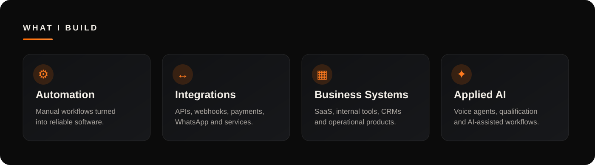
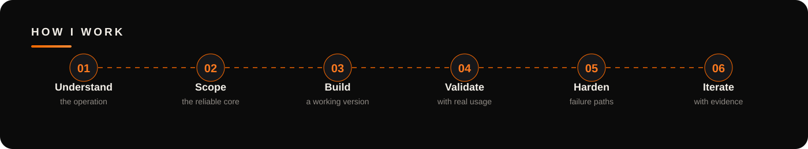

  
  

  

<h2 align="center">Full-Stack Developer · Automation · AI Integrations · Business Systems</h2>

  I turn manual workflows and disconnected tools into software that is useful, maintainable and ready to operate.

  
  
  

<strong>Python · TypeScript · APIs · Automation · Integrations · SaaS · Applied AI</strong>

 

  

 

## Featured work

<table>
<tr>
<td width="50%" valign="top">

### UTMZAP — Lead Tracking & CRM
Lead attribution system for agencies, combining trackable campaign links, UTM capture, WhatsApp flows and a mini-CRM.

**Electron · React · TypeScript · Next.js · Supabase · PostgreSQL**

[View case study →](./case-studies/lead-tracking-crm.md)
</td>
<td width="50%" valign="top">

### AI Voice Operations — Sophie
AI receptionist for a U.S. service business, handling inbound calls, qualifying leads and sending structured summaries to the team through WhatsApp.

**Vapi · Webhooks · APIs · Docker · Linux/VPS · WhatsApp**

[View case study →](./case-studies/ai-voice-operations.md)
</td>
</tr>
</table>

### More systems

<table>
<tr>
<td width="33%" valign="top">

#### Distributed Browser Automation
Remote agents, centralized control, scheduling, recovery and long-running browser workflows.

[Case study →](./case-studies/distributed-browser-automation.md)

</td>
<td width="33%" valign="top">

#### Marketplace Payment Infrastructure
Multi-vendor payment splitting, financial rules, idempotency and refund/reversal handling.

[Case study →](./case-studies/marketplace-payment-infrastructure.md)

</td>
<td width="33%" valign="top">

#### SaaS Benchmarking Platform
Authentication, CSV ingestion, metric processing, dashboards, roles and protected admin flows.

[Case study →](./case-studies/saas-benchmarking-platform.md)

</td>
</tr>
</table>

---

## Selected technologies

  
  
  
  
  
  
  
  
  

<strong>Web · Desktop · APIs · Automation · Infrastructure · Integrations</strong>

 

  

I prefer a useful first version with clear boundaries over a large specification that never reaches production.

---

<strong>Technical depth</strong>

 

### Reliability & automation
- Browser/session recovery for long-running agents
- Concurrency and minimum-interval rules
- Scheduled execution and run-state tracking
- Logs and operational visibility
- Remote agents with centralized control

### APIs & integrations
- REST APIs and webhook consumers
- WhatsApp and voice-agent handoffs
- External provider constraints and failure handling
- Server-side validation and redirect safety
- Payment and marketplace integrations

### Product & data boundaries
- Authentication and role-aware access
- Supabase RLS / company-scoped data
- Mini-CRMs and admin surfaces
- CSV/file ingestion and persisted metrics
- Web + desktop hybrid systems

### Financial correctness
- Idempotent processing
- Duplicate protection
- Refund/reversal flows
- Multi-vendor allocation rules
- Automated tests around business-critical logic

<strong>Public code</strong>

 

| Repository | What you can inspect |
|---|---|
| **[defi-alert-bot](https://github.com/KarlosSanchez18/defi-alert-bot)** | Scheduled data collection, DeFiLlama integration, Telegram delivery, alert rules and subscription flow. |
| **[telegram-message-router](https://github.com/KarlosSanchez18/telegram-message-router)** | Async Telegram routing with Telethon, source/target rules, topics and scheduled workflows. |
| **[automation-bot](https://github.com/KarlosSanchez18/automation-bot)** | Flask integration layer receiving events and forwarding structured Telegram notifications. |

Commercial/client repositories remain private when they contain proprietary code or sensitive operational details.

---

<h2 align="center">Open to building useful software</h2>

<strong>Freelance projects · Remote contracts · Automation · Integrations · Full-Stack product development</strong>

  

<strong>Systems that work.</strong> <em>From manual process to production-ready software.</em>
