  
  

  

  

  
  
  

 

## I like the part before the software looks obvious

A lot of the work I take on starts as a messy routine instead of a clean specification: someone opens three systems, copies a value, checks a spreadsheet, sends a WhatsApp message and remembers to come back later.

That is usually the useful part to automate.

I build **web and desktop systems, APIs, browser automations, payment flows and AI-assisted operations**. The stack changes from project to project; the goal does not: fewer fragile handoffs, less repetitive work and something people can actually operate every day.

---

## Selected work

### UTMZAP — keeping attribution alive when the lead moves to WhatsApp

  

An agency needed campaign context to survive the jump into WhatsApp. I built the flow around that gap: trackable links, UTM/ad capture, click and lead events, a client portal and a mini-CRM for the team to work from afterwards.

`Electron` `React` `TypeScript` `Next.js` `Supabase` `PostgreSQL`

**[Open the case study →](./case-studies/lead-tracking-crm.md)**

 

### Sophie — the phone rings, the team receives the useful part

  

For a U.S. cleaning business, I built an inbound voice assistant that qualifies the caller, captures the information the operation needs and sends a structured WhatsApp summary to the team after the call.

The interesting work is around the conversation: structured capture, webhooks, post-call processing, delivery and the infrastructure keeping the handoff alive.

`Vapi` `Webhooks` `APIs` `Docker` `Linux/VPS` `WhatsApp`

**[Open the case study →](./case-studies/ai-voice-operations.md)**

---

## Not every useful system has a pretty screenshot

| | System | The part that mattered |
|---|---|---|
| ⚙️ | **[Distributed Browser Automation](./case-studies/distributed-browser-automation.md)** | Remote agents, scheduled runs, concurrency rules, session recovery and centralized control for long-running browser work. |
| ↔️ | **[Marketplace Payment Infrastructure](./case-studies/marketplace-payment-infrastructure.md)** | WooCommerce/Dokan/Asaas split rules, duplicate protection, refunds/reversals and financial edge cases. |
| ◫ | **[SaaS Benchmarking Platform](./case-studies/saas-benchmarking-platform.md)** | Authentication, company/user boundaries, CSV ingestion, persisted metrics, dashboards and protected admin flows. |

---

## The kind of message that usually becomes a project

  

<strong>Under the hood — tools, public code and technical depth</strong>

 

**Main tools:** Python, FastAPI, Flask, Django, TypeScript, React, Next.js, Electron, PostgreSQL, Supabase, Docker, Playwright/Selenium and Linux/VPS.

**Things I regularly care about:** recovery for long-running browser sessions, retries and idempotency, authentication and data boundaries, webhook failure handling, logs, payment edge cases and keeping the first useful version small enough to actually ship.

### Public code

| Repository | What you can inspect |
|---|---|
| **[defi-alert-bot](https://github.com/KarlosSanchez18/defi-alert-bot)** | Scheduled data collection, DeFiLlama integration, Telegram delivery, alert rules and subscription flow. |
| **[telegram-message-router](https://github.com/KarlosSanchez18/telegram-message-router)** | Async Telegram routing with Telethon, source/target rules, topics and scheduled workflows. |
| **[automation-bot](https://github.com/KarlosSanchez18/automation-bot)** | Flask integration layer receiving events and forwarding structured Telegram notifications. |

Commercial/client repositories stay private when they contain proprietary code or sensitive operational details.

 

the orange pixel is eating my contribution graph ↓

<picture>
  <source media="(prefers-color-scheme: dark)" srcset="https://raw.githubusercontent.com/KarlosSanchez18/KarlosSanchez18/output/github-snake-dark.svg" />
  <source media="(prefers-color-scheme: light)" srcset="https://raw.githubusercontent.com/KarlosSanchez18/KarlosSanchez18/output/github-snake.svg" />
  
</picture>

---

<h2 align="center">Have a process that should not still be manual?</h2>

Send me the messy version. We can figure out what is actually worth turning into software.

  
  

Systems that work. Not just screenshots that look finished.
