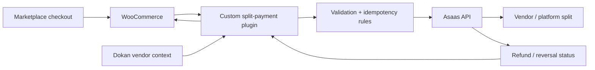

# Marketplace Payment Infrastructure

## Overview

A custom payment integration for a WooCommerce marketplace using Dokan and Asaas. The goal was to support multi-vendor payment splitting while keeping the financial flow predictable and compatible with the existing store.

## Problem

Marketplace payments introduce more than a simple checkout integration. The system needed rules for vendor allocation, validation, refunds/reversals and protection against duplicate or concurrent processing.

## My role

I worked on the custom WordPress plugin and payment flow, including:

- WooCommerce integration;
- Dokan vendor context;
- Asaas split-payment rules;
- vendor wallet/account mapping;
- validation before sending payment instructions;
- refund/reversal flow investigation;
- idempotency and duplicate-processing protections;
- concurrency handling;
- automated/unit tests for core rules;
- compatibility considerations for WooCommerce HPOS.

## Architecture

### Commerce layer

- WordPress
- WooCommerce
- Dokan marketplace

### Payment layer

- Asaas API
- split rules for vendor/platform allocation
- refund and reversal handling

### Reliability layer

- validation before external calls;
- idempotent processing;
- logging;
- automated tests for financial rules;
- explicit handling of sandbox/API limitations.

## Engineering focus

- Avoid double accounting between legacy Dokan behavior and the custom integration.
- Make payment operations safe to retry where possible.
- Keep financial rules isolated from transport/API concerns so they can be tested independently.
- Treat provider permissions and sandbox behavior as part of the integration contract, not as application logic.

## Stack

`PHP` · `WordPress` · `WooCommerce` · `Dokan` · `Asaas API` · `Automated tests`

## Status

The split-payment flow and core plugin structure were implemented and tested. Refund behavior required additional validation because PIX refund operations in the provider sandbox returned permission-related limitations.

## Privacy

Production credentials, merchant identifiers and store-specific financial data are not included.
