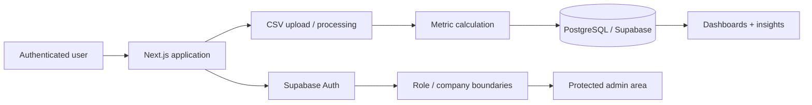

# SaaS Benchmarking Platform

## Overview

A SaaS application for service benchmarking and operational analysis. The platform lets authenticated users upload data, calculate metrics, compare performance and access dashboards and insights within company-scoped accounts.

## Problem

The client needed more than a static dashboard: the product required authentication, account/role boundaries, trial behavior, file ingestion, metric processing, persistence and an administrative area that could evolve with the service.

## My role

I implemented the first product phase end to end, including:

- Supabase authentication;
- role-aware access control;
- company/user relationships;
- 7-day trial rules;
- CSV upload flow;
- metric calculation and persistence;
- dashboard and insight views;
- server-side proxying where needed;
- cookie/session cleanup and redirect behavior;
- protected admin routes;
- deployment and validation.

## Architecture

### Application

- Next.js
- TypeScript
- server/client boundaries for authenticated flows

### Backend/data

- Supabase Auth
- PostgreSQL
- company/user relationships
- persisted analysis results

### Product concerns

- trial state;
- role/permission checks;
- uploaded-file processing;
- authenticated redirects;
- admin-only surfaces.

## Engineering decisions

- Keep authorization enforced outside the UI so hidden controls are not the only protection.
- Persist computed results instead of forcing users to reprocess the same source file for every view.
- Use server-side handling for flows that should not expose implementation details or credentials to the browser.
- Deliver the product in phases, keeping the first version focused on the core benchmarking workflow.

## Stack

`Next.js` · `TypeScript` · `Supabase` · `PostgreSQL` · `Authentication` · `CSV processing`

## Result

The first phase was delivered with authentication, trial logic, company/user structure, file import, metric processing, persistence and protected administrative functionality.

## Privacy

The production repository remains private. This case study documents the engineering scope without exposing client data or proprietary business rules.
